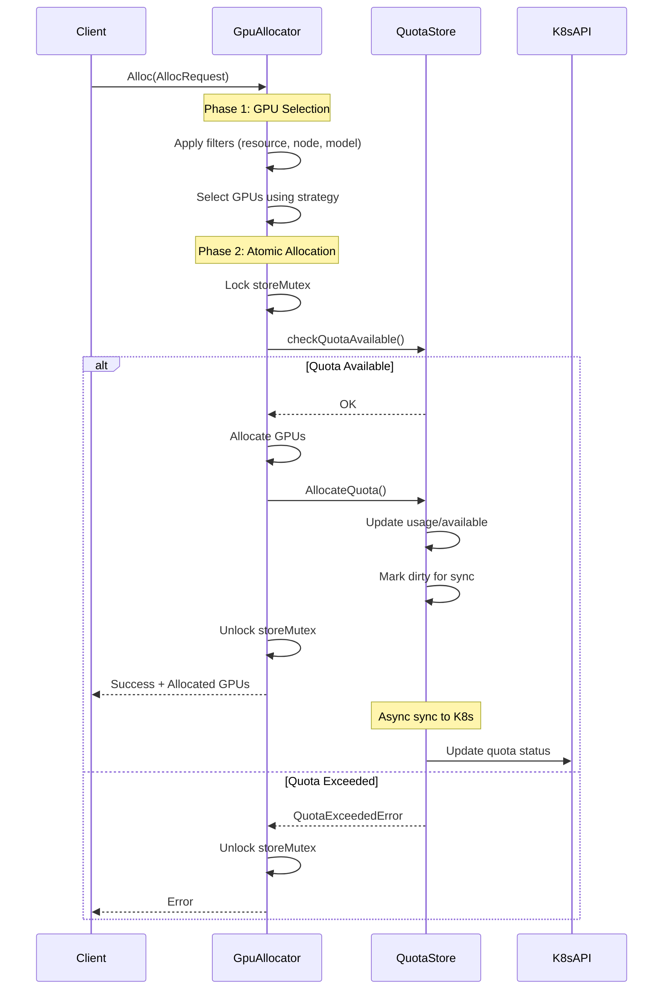
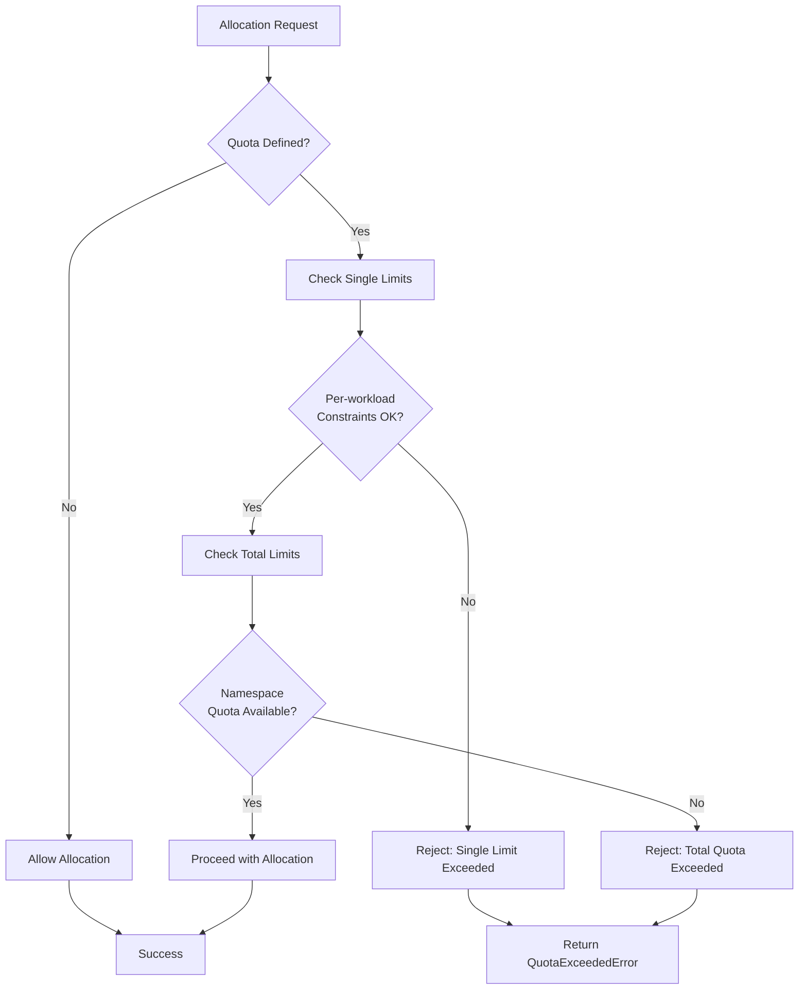
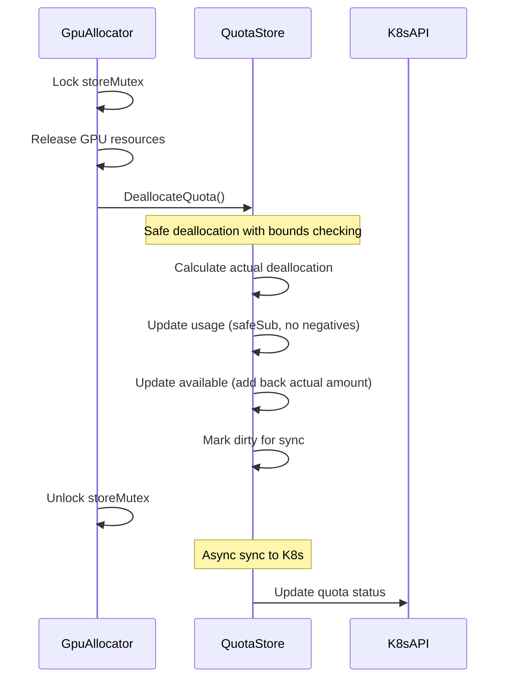
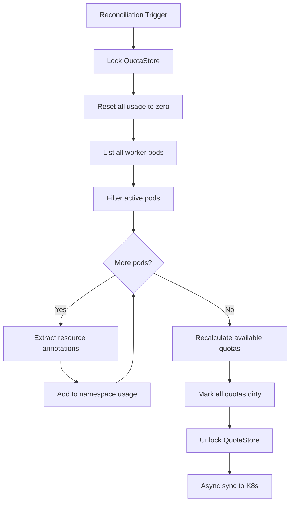

# GPU Resource Quota System - Design Workflow

## Table of Contents
1. [System Overview](#system-overview)
2. [Architecture Components](#architecture-components)
3. [Data Models](#data-models)
4. [Core Workflows](#core-workflows)
5. [Integration Patterns](#integration-patterns)
6. [Performance Design](#performance-design)
7. [Error Handling Strategy](#error-handling-strategy)
8. [Observability Design](#observability-design)
9. [Scalability Considerations](#scalability-considerations)
10. [Future Extensions](#future-extensions)

## System Overview

The GPU Resource Quota System provides comprehensive resource management for GPU workloads in Kubernetes environments. It enforces both namespace-wide and per-workload resource limits while maintaining high performance through in-memory operations and atomic allocation guarantees.

### Key Design Principles
- **Performance First**: Critical path operations use in-memory data structures
- **Atomic Consistency**: All quota operations are atomic to prevent over-allocation
- **Kubernetes Native**: Follows standard CRD and controller patterns
- **Observable**: Rich status reporting and event generation
- **Recoverable**: State reconciliation handles corruption scenarios

## Architecture Components

### Core Components Diagram
```
┌─────────────────────────────────────────────────────────┐
│                    Kubernetes API                       │
├─────────────────┬─────────────────┬─────────────────────┤
│ GPUResourceQuota│    GPU CRDs     │    Worker Pods      │
│      (CRD)      │                 │                     │
└─────────────────┴─────────────────┴─────────────────────┘
         │                   │               │
         │                   │               │
         ▼                   ▼               ▼
┌─────────────────┐ ┌─────────────────┐ ┌─────────────────┐
│ Quota Controller│ │  GPU Allocator  │ │ Reconciliation  │
│                 │ │                 │ │    Engine       │
└─────────────────┘ └─────────────────┘ └─────────────────┘
         │                   │               │
         │                   ▼               │
         │          ┌─────────────────┐      │
         └─────────▶│   Quota Store   │◀─────┘
                    │   (In-Memory)   │
                    └─────────────────┘
```

### Component Responsibilities

#### 1. **QuotaStore** (Core Engine)
```go
type QuotaStore struct {
    client.Client
    quotaStore     map[string]*QuotaStoreEntry  // namespace -> quota
    storeMutex     sync.RWMutex                 // thread safety
    dirtyQuotas    map[string]struct{}          // sync optimization
    dirtyQuotaLock sync.Mutex
}
```

**Responsibilities:**
- Maintain in-memory quota cache for fast access
- Enforce atomic allocation/deallocation operations
- Validate quota constraints (single + total limits)
- Handle state reconciliation from actual workloads
- Sync quota status back to Kubernetes

#### 2. **GpuAllocator** (Orchestrator)
**Responsibilities:**
- Coordinate GPU selection and allocation workflow
- Integrate quota checking into allocation pipeline
- Manage allocation state synchronization
- Handle concurrent allocation requests

#### 3. **GPUResourceQuotaReconciler** (Controller)
**Responsibilities:**
- Monitor quota usage from TensorFusionWorkload objects
- Update quota status and conditions in Kubernetes
- Generate alert events when thresholds are exceeded
- Provide external observability into quota state

## Data Models

### Core Data Structures

#### 1. **GPUResourceQuota Specification**
```yaml
apiVersion: tensor-fusion.ai/v1
kind: GPUResourceQuota
metadata:
  name: team-a-quota
  namespace: team-a
spec:
  total:                          # Namespace-wide limits
    requests.tflops: "1000"       # Total compute capacity
    requests.vram: "100Gi"        # Total memory capacity
    workers: 50                   # Total GPU instances
    alertThresholdPercent: 90     # Alert trigger level
  single:                         # Per-workload constraints
    max:
      tflops: "100"               # Max compute per workload
      vram: "16Gi"                # Max memory per workload
      workers: 8                  # Max GPUs per workload
    min:
      tflops: "1"                 # Min compute per workload
      vram: "1Gi"                 # Min memory per workload
```

#### 2. **QuotaStoreEntry** (Runtime State)
```go
type QuotaStoreEntry struct {
    quota        *tfv1.GPUResourceQuota    // K8s resource definition
    currentUsage *tfv1.GPUResourceUsage    // Real-time usage (authoritative)
    available    *tfv1.GPUResourceUsage    // Computed available quota
}
```

#### 3. **Resource Types**
```go
type GPUResourceUsage struct {
    RequestsTFlops *resource.Quantity       // Compute requests
    RequestsVRAM   *resource.Quantity       // Memory requests
    LimitsTFlops   *resource.Quantity       // Compute limits
    LimitsVRAM     *resource.Quantity       // Memory limits
    Workers        *int32                   // GPU instance count
}
```

### Resource Relationship Model
```
GPUResourceQuota (K8s)
    │
    ├── Spec (Configuration)
    │   ├── Total Limits (Namespace-wide)
    │   └── Single Limits (Per-workload)
    │
    └── Status (Runtime State)
        ├── Used (Current consumption)
        ├── AvailablePercent (Computed)
        └── Conditions (State flags)

QuotaStoreEntry (Memory)
    │
    ├── quota → GPUResourceQuota
    ├── currentUsage → Real-time tracking
    └── available → quota.total - currentUsage
```

## Core Workflows

### 1. GPU Allocation Workflow



### 2. Quota Validation Workflow



### 3. Deallocation Workflow



### 4. State Reconciliation Workflow



## Integration Patterns

### 1. Filter Integration Pattern
```go
// Quota integrated as allocation filter
filterRegistry := s.filterRegistry.With(
    filter.NewResourceFilter(req.Request),
    filter.NewQuotaFilter(s.quotaStore, req),  // Quota enforcement
    filter.NewSameNodeFilter(req.Count),
)

filteredGPUs, err := filterRegistry.Apply(ctx, poolGPUs)
```

### 2. Two-Phase Commit Pattern
```go
// Phase 1: Check availability
if err := s.quotaStore.checkQuotaAvailable(namespace, req); err != nil {
    return nil, fmt.Errorf("quota check failed: %w", err)
}

// Phase 2: Atomic allocation under lock
s.storeMutex.Lock()
defer s.storeMutex.Unlock()

// Allocate both GPU and quota atomically
allocateGPUs(selectedGPUs, req)
s.quotaStore.AllocateQuota(namespace, req)
```

### 3. Dirty Flag Optimization Pattern
```go
// Immediate in-memory updates
qs.AllocateQuota(namespace, req)

// Deferred K8s API sync
qs.markQuotaDirty(namespace)  // Flag for async sync
```

## Performance Design

### 1. **Fast Path Optimization**
- **In-Memory Operations**: Critical path uses local data structures
- **Lock Minimization**: Single mutex protects both GPU and quota state
- **Batch API Updates**: Dirty flag pattern reduces K8s API calls

### 2. **Concurrency Design**
```go
type QuotaStore struct {
    storeMutex     sync.RWMutex  // Protects quota state
    dirtyQuotaLock sync.Mutex    // Protects sync queue
}

// Read operations can proceed concurrently
func (qs *QuotaStore) GetQuotaStatus(...) {
    qs.storeMutex.RLock()
    defer qs.storeMutex.RUnlock()
    // ... read operations
}

// Write operations are exclusive
func (qs *QuotaStore) AllocateQuota(...) {
    // Called under GpuAllocator's exclusive lock
    // ... write operations
}
```

### 3. **Memory Efficiency**
- **Namespace Partitioning**: Quotas stored per namespace
- **Lazy Loading**: Quotas loaded only when needed
- **Efficient Data Structures**: Maps for O(1) lookup

### 4. **Performance Metrics**
```go
// Benchmark results from test suite
BenchmarkQuotaStore_Allocation-24     1000000  1.2 μs/op
BenchmarkQuotaStore_Deallocation-24    800000  1.5 μs/op
BenchmarkQuotaStore_ConcurrentOps-24   500000  2.1 μs/op
```

## Error Handling Strategy

### 1. **Error Types and Recovery**

#### QuotaExceededError (Structured Error Information)
```go
type QuotaExceededError struct {
    Namespace string              // Where the violation occurred
    Resource  string              // Which resource limit hit (e.g., "total.requests.tflops")
    Requested resource.Quantity   // Amount requested
    Available resource.Quantity   // Currently available
    Limit     resource.Quantity   // The quota limit
}

func (e *QuotaExceededError) Error() string {
    return fmt.Sprintf("quota exceeded in namespace %s for %s: requested %s, available %s, limit %s",
        e.Namespace, e.Resource, e.Requested.String(), e.Available.String(), e.Limit.String())
}
```

### 2. **Graceful Degradation Patterns**

#### No Quota Defined
```go
func (qs *QuotaStore) checkQuotaAvailable(namespace string, req AllocRequest) error {
    entry, exists := qs.quotaStore[namespace]
    if !exists {
        return nil  // No quota = unlimited allocation
    }
    // ... quota enforcement logic
}
```

#### State Corruption Recovery
```go
func (qs *QuotaStore) reconcileQuotaStore(ctx context.Context, workerPods []v1.Pod) {
    // Reset all usage to zero
    for _, entry := range qs.quotaStore {
        entry.currentUsage.RequestsTFlops.Set(0)
        // ... reset all resources
    }
    
    // Rebuild from actual pod state
    for _, pod := range workerPods {
        if isActivePod(pod) {
            qs.addPodToUsage(entry, &pod)
        }
    }
}
```

### 3. **Bounds Checking and Safe Operations**
```go
func (qs *QuotaStore) safeSub(a *resource.Quantity, b resource.Quantity) {
    if a == nil {
        return
    }
    a.Sub(b)
    if a.Sign() < 0 {
        a.Set(0)  // Prevent negative values
    }
}

func (qs *QuotaStore) DeallocateQuota(namespace string, request tfv1.Resource, replicas int32) {
    // Calculate actual deallocation amounts (clamped to current usage)
    actualTFlopsDealloc := min(currentUsage.RequestsTFlops, totalTFlopsRequest)
    // ... safe deallocation logic
}
```

## Observability Design

### 1. **Status Reporting Structure**
```yaml
status:
  used:                           # Current consumption
    requests.tflops: "750"
    requests.vram: "75Gi"
    workers: 38
  availablePercent:               # Computed availability
    requests.tflops: 25           # 25% available
    requests.vram: 25             # 25% available
    workers: 24                   # 24% available
  conditions:                     # State machine
    - type: Ready
      status: "True"
      reason: QuotaActive
    - type: AlertThresholdReached
      status: "True"
      reason: ThresholdReached
      message: "Usage exceeds 90% threshold"
  lastUpdateTime: "2024-01-15T10:30:00Z"
```

### 2. **Event Generation**
```go
func (r *GPUResourceQuotaReconciler) generateAlertEvent(quota *tfv1.GPUResourceQuota, threshold int32) {
    r.Recorder.Event(quota, "Warning", "QuotaAlertThreshold",
        fmt.Sprintf("Quota usage exceeds %d%% threshold", threshold))
}
```

### 3. **Logging Strategy**
```go
// Structured logging with context
log.V(1).Info("GPU allocation successful",
    "namespace", req.WorkloadNameNamespace.Namespace,
    "workload", req.WorkloadNameNamespace.Name,
    "pool", req.PoolName,
    "requested", req.Count,
    "allocated", len(selectedGPUs),
    "tflops", req.Request.Tflops.String(),
    "vram", req.Request.Vram.String())
```

### 4. **Metrics Integration Points**
```go
// Prometheus metrics (implementation points)
var (
    quotaUsageGauge = prometheus.NewGaugeVec(
        prometheus.GaugeOpts{
            Name: "gpu_quota_usage_ratio",
            Help: "Current quota usage as ratio of total",
        },
        []string{"namespace", "resource_type"},
    )
)
```

## Scalability Considerations

### 1. **Horizontal Scaling Design**
- **Namespace Isolation**: Quotas partitioned by namespace
- **Controller Sharding**: Multiple controllers can handle different namespaces
- **API Efficiency**: Batch updates reduce K8s API load

### 2. **Vertical Scaling Patterns**
```go
// Memory usage scales with number of active quotas
// Typical memory footprint per quota: ~1KB
// System can handle 10,000+ quotas efficiently

type QuotaStore struct {
    quotaStore map[string]*QuotaStoreEntry  // O(1) lookup
    // Memory: O(namespaces_with_quotas)
}
```

### 3. **Performance Scaling Characteristics**
- **Allocation Latency**: O(1) with respect to quota count
- **Memory Usage**: O(namespace_count)
- **API Load**: O(quota_changes) not O(allocations)

### 4. **Load Distribution Strategies**
```go
// Multi-controller deployment example
// Controller A: Handles namespaces matching label selector A
// Controller B: Handles namespaces matching label selector B
// Quota stores are independent per controller
```

## Future Extensions

### 1. **Advanced Scheduling Integration**
```yaml
# Potential future features
spec:
  schedulingPolicy:
    priority: "high"                    # Priority-based allocation
    preemption: "enabled"               # Allow workload preemption
    borrowing:                          # Cross-namespace borrowing
      enabled: true
      fromNamespaces: ["team-b", "shared"]
```

### 2. **Time-Based Quotas**
```yaml
spec:
  timeWindows:
    - schedule: "0 9 * * 1-5"           # Business hours
      total:
        requests.tflops: "2000"         # Higher limits during work
    - schedule: "0 18 * * 1-5"          # After hours
      total:
        requests.tflops: "500"          # Lower limits
```

### 3. **Multi-Cluster Quotas**
```yaml
spec:
  federation:
    enabled: true
    clusters: ["cluster-a", "cluster-b"]
    total:                              # Quota across clusters
      requests.tflops: "5000"
```

### 4. **Advanced Resource Types**
```yaml
spec:
  total:
    requests.tflops: "1000"
    requests.vram: "100Gi"
    requests.bandwidth: "10Gbps"        # Network bandwidth
    requests.storage: "1Ti"             # Storage quota
    custom.resources/special-gpu: 10    # Custom resource support
```

### 5. **Machine Learning Workload Integration**
```yaml
spec:
  workloadTypes:
    training:                           # Training workloads
      total:
        requests.tflops: "800"
      priority: 1
    inference:                          # Inference workloads
      total:
        requests.tflops: "200"
      priority: 2
```

---

## Summary

The GPU Resource Quota System provides a robust, performant, and Kubernetes-native solution for managing GPU resources at scale. Key design strengths include:

- **High Performance**: In-memory operations with atomic guarantees
- **Comprehensive Policy**: Both namespace and workload-level controls
- **Production Ready**: Extensive error handling and recovery mechanisms
- **Observable**: Rich status reporting and event generation
- **Scalable**: Efficient data structures and API usage patterns
- **Extensible**: Clean architecture enables future enhancements

The system successfully balances the competing requirements of performance, consistency, and observability while providing a foundation for advanced GPU resource management in multi-tenant Kubernetes environments.