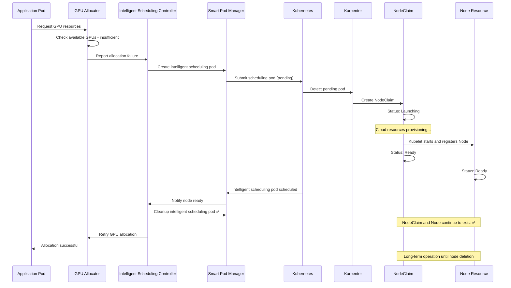

# Karpenter Integration Design: GPU Auto-Scaling via Intelligent Pod Scheduling

## Overview

This design document presents a completely new approach for GPU resource auto-scaling based on deep research into Karpenter's NodeClaim working mechanisms. Instead of directly manipulating NodeClaims (which Karpenter doesn't recommend), this solution uses an intelligent pod scheduling mechanism to trigger Karpenter's automatic scaling, achieving more efficient and Karpenter-native GPU resource management.

## Problem Analysis

### Original Problem
When GPU allocation fails due to insufficient resources, Karpenter cannot sense this and automatically scale up new nodes with the required GPU type.

### Key Findings
Through research into Karpenter's working mechanisms, we discovered:
1. **NodeClaims should not be created directly by external applications** - Karpenter officially states that NodeClaims are automatically managed by Karpenter
2. **Karpenter triggers scaling by monitoring pending pods** - This is Karpenter's core working principle
3. **The correct approach is to create appropriate pods to trigger NodeClaim creation**

## Core Design Philosophy

### Intelligent Pod Trigger Mechanism
```
GPU allocation failure → Create intelligent scheduling pod → Karpenter detects pending pod 
→ Automatically creates NodeClaim → Node ready → Cleanup intelligent scheduling pod → Retry original allocation
```

Advantages of this approach:
- **Aligns with Karpenter design philosophy** - Triggers scaling through pod demand
- **No direct NodeClaim manipulation** - Let Karpenter manage automatically
- **Fast response** - Karpenter can respond to pending pods within seconds
- **Low resource overhead** - Intelligent scheduling pods are lightweight signals

## Solution Architecture

### 1. Core Components

#### 1.1 Intelligent Scheduling Controller
**Location**: `internal/controller/intelligent_scheduling_controller.go`

**Responsibilities**:
- Monitor GPU allocation failures
- Create intelligent scheduling pods to trigger Karpenter
- Monitor NodeClaim status changes
- Manage intelligent scheduling pod lifecycle
- Cleanup pods and retry allocation after node ready

#### 1.2 Smart Pod Manager
**Location**: `internal/karpenter/smart_pod_manager.go`

**Responsibilities**:
- Generate scheduling pod specifications for specific GPU types
- Create scheduling pods with precise resource requirements
- Monitor pod scheduling status and node binding
- Cleanup scheduling pods at appropriate times

#### 1.3 NodeClaim Monitor
**Location**: `internal/karpenter/nodeclaim_monitor.go`

**Responsibilities**:
- Monitor NodeClaims created by Karpenter
- Track NodeClaim lifecycle from creation to Ready
- Trigger resource availability checks when node is Ready
- Provide real-time NodeClaim status feedback

### 2. Design Details

#### 2.1 Core Workflow

**Important Note**: NodeClaim and Node are long-term coexisting resources, only the intelligent scheduling pod is a temporary resource. NodeClaim will not be deleted after node creation; it will run together with the Node until the node is deleted, when Karpenter will clean up both.



#### 2.2 Intelligent Scheduling Pod Specification

Key characteristics of intelligent scheduling pods:
- **Precise resource requests** - Reflect actual GPU requirements
- **Appropriate scheduling constraints** - Ensure correct NodePool is triggered
- **Minimal runtime overhead** - Use lightweight containers
- **Clear identification** - Easy monitoring and cleanup

```yaml
apiVersion: v1
kind: Pod
metadata:
  name: smart-gpu-scheduler-<gpu-model>-<hash>
  namespace: tensor-fusion-system
  labels:
    tensor-fusion.ai/component: smart-scheduler
    tensor-fusion.ai/gpu-model: <gpu-model>
    tensor-fusion.ai/pool: <pool-name>
    tensor-fusion.ai/trigger-type: gpu-scaling
  annotations:
    tensor-fusion.ai/created-by: intelligent-scheduling-controller
    tensor-fusion.ai/purpose: trigger-karpenter-scaling
    tensor-fusion.ai/original-request: <serialized-request>
    tensor-fusion.ai/cleanup-after: "node-ready"
spec:
  restartPolicy: Never
  schedulerName: default-scheduler
  # Key: Set appropriate scheduling constraints
  nodeSelector:
    node.kubernetes.io/instance-type: <gpu-instance-type>
  tolerations:
  - key: nvidia.com/gpu
    operator: Exists
    effect: NoSchedule
  # Key: Set precise resource requests
  containers:
  - name: gpu-trigger
    image: registry.k8s.io/pause:3.9  # Most lightweight container
    resources:
      requests:
        nvidia.com/gpu: <gpu-count>
        memory: <vram-equivalent>
        cpu: 100m  # Minimal CPU request
      limits:
        nvidia.com/gpu: <gpu-count>
        memory: <vram-equivalent>
        cpu: 100m
  # Key: Prevent long-running
  activeDeadlineSeconds: 600  # Auto-cleanup after 10 minutes
```

#### 2.3 Intelligent Scheduling Controller Implementation

```go
type IntelligentSchedulingController struct {
    client.Client
    Scheme              *runtime.Scheme
    SmartPodManager     *SmartPodManager
    NodeClaimMonitor    *NodeClaimMonitor
    cleanupInterval     time.Duration
    maxRetryAttempts    int
}

// Core reconciliation logic
func (isc *IntelligentSchedulingController) Reconcile(ctx context.Context, req ctrl.Request) (ctrl.Result, error) {
    // Handle intelligent scheduling pod status changes
    // Monitor NodeClaim creation and ready status
    // Trigger resource availability checks
    // Manage pod cleanup and retry logic
}

// Trigger intelligent scaling for GPU
func (isc *IntelligentSchedulingController) TriggerIntelligentScaling(ctx context.Context, failure AllocationFailure) error {
    // 1. Analyze failure reason and resource requirements
    // 2. Generate intelligent scheduling pod specification
    // 3. Create scheduling pod
    // 4. Start NodeClaim monitoring
    // 5. Set cleanup and retry logic
}

// Handle node ready events
func (isc *IntelligentSchedulingController) HandleNodeReady(ctx context.Context, nodeClaimName string) error {
    // 1. Cleanup corresponding intelligent scheduling pod
    // 2. Trigger GPU resource availability check
    // 3. Retry original allocation request
    // 4. Update monitoring metrics
}
```

#### 2.4 Smart Pod Manager Implementation

```go
type SmartPodManager struct {
    client.Client
    activePods      map[string]*SmartPodInfo
    mutex           sync.RWMutex
    podTemplate     *corev1.Pod
}

type SmartPodInfo struct {
    Pod                 *corev1.Pod
    CreationTime        time.Time
    GPUModel            string
    PoolName            string
    OriginalRequest     AllocRequest
    NodeClaimName       string
    Status              SmartPodStatus
    RetryCount          int
}

type SmartPodStatus string

const (
    SmartPodStatusPending    SmartPodStatus = "Pending"
    SmartPodStatusScheduled  SmartPodStatus = "Scheduled"
    SmartPodStatusNodeReady  SmartPodStatus = "NodeReady"
    SmartPodStatusCompleted  SmartPodStatus = "Completed"
    SmartPodStatusFailed     SmartPodStatus = "Failed"
)

// Create intelligent scheduling pod
func (spm *SmartPodManager) CreateSmartPod(ctx context.Context, failure AllocationFailure) (*SmartPodInfo, error) {
    // 1. Generate pod specification
    // 2. Set precise resource requests
    // 3. Configure scheduling constraints
    // 4. Create pod and track status
    // 5. Return pod info for monitoring
}

// Monitor pod scheduling status
func (spm *SmartPodManager) MonitorPodScheduling(ctx context.Context, podInfo *SmartPodInfo) error {
    // 1. Monitor pod scheduling to node
    // 2. Detect NodeClaim creation
    // 3. Track node initialization process
    // 4. Update pod status
}

// Cleanup completed intelligent scheduling pods
func (spm *SmartPodManager) CleanupCompletedPods(ctx context.Context) error {
    // 1. Iterate through active intelligent scheduling pods
    // 2. Check if corresponding node is ready and resources available
    // 3. Delete intelligent scheduling pods that have completed their mission (Note: Do not delete NodeClaim and Node)
    // 4. Update statistics
}
```

#### 2.5 NodeClaim Monitor Implementation

```go
type NodeClaimMonitor struct {
    client.Client
    activeNodeClaims map[string]*NodeClaimInfo
    mutex            sync.RWMutex
    eventChannel     chan NodeClaimEvent
}

type NodeClaimInfo struct {
    NodeClaim       *karpenterv1.NodeClaim
    CreationTime    time.Time
    Status          NodeClaimPhase
    AssociatedPod   string
    NodeName        string
}

type NodeClaimEvent struct {
    Type         NodeClaimEventType
    NodeClaim    string
    Node         string
    Timestamp    time.Time
}

type NodeClaimEventType string

const (
    NodeClaimCreated     NodeClaimEventType = "Created"
    NodeClaimLaunching   NodeClaimEventType = "Launching"
    NodeClaimRegistering NodeClaimEventType = "Registering"
    NodeClaimReady       NodeClaimEventType = "Ready"
    NodeClaimFailed      NodeClaimEventType = "Failed"
)

// Monitor NodeClaim lifecycle
func (ncm *NodeClaimMonitor) MonitorNodeClaim(ctx context.Context, nodeClaimName string) error {
    // 1. Subscribe to NodeClaim status changes
    // 2. Track full process from creation to Ready
    // 3. Send status change events
    // 4. Handle failure and timeout situations
}

// Detect newly created NodeClaims
func (ncm *NodeClaimMonitor) DetectNewNodeClaims(ctx context.Context) error {
    // 1. Listen for NodeClaim creation events
    // 2. Associate with corresponding intelligent scheduling pods
    // 3. Start status tracking
    // 4. Update monitoring metrics
}
```

### 3. Integration Points

#### 3.1 GPU Allocator Integration

```go
func (s *GpuAllocator) Alloc(ctx context.Context, req AllocRequest) ([]*tfv1.GPU, error) {
    // ... existing allocation logic ...
    
    if len(filteredGPUs) == 0 {
        failure := AllocationFailure{
            Reason:       AllocationFailureInsufficientResources,
            GPUModel:     req.GPUModel,
            PoolName:     req.PoolName,
            RequestedGPU: req.Count,
            TFlops:       req.Request.Tflops,
            VRAMRequest:  req.Request.Vram,
            NodeAffinity: req.NodeAffinity,
        }
        
        // Trigger intelligent scaling
        if err := s.triggerIntelligentScaling(ctx, failure); err != nil {
            log.FromContext(ctx).Error(err, "Failed to trigger intelligent scaling")
        }
        
        return nil, fmt.Errorf("insufficient GPU resources in pool %s, auto-scaling triggered", req.PoolName)
    }
    
    // ... rest of existing logic ...
}

// Trigger intelligent scaling
func (s *GpuAllocator) triggerIntelligentScaling(ctx context.Context, failure AllocationFailure) error {
    // Check if there's already an active scaling request for the same type
    if s.hasActiveScalingRequest(failure.GPUModel, failure.PoolName) {
        return nil // Avoid duplicate triggers
    }
    
    // Create intelligent scaling request
    return s.intelligentScheduler.TriggerIntelligentScaling(ctx, failure)
}
```

#### 3.2 NodePool Configuration Integration

```yaml
apiVersion: karpenter.sh/v1
kind: NodePool
metadata:
  name: gpu-a100-pool
spec:
  template:
    metadata:
      labels:
        tensor-fusion.ai/gpu-type: "a100"
        tensor-fusion.ai/managed: "true"
    spec:
      requirements:
      - key: karpenter.k8s.aws/instance-gpu-name
        operator: In
        values: ["a100"]
      - key: karpenter.k8s.aws/instance-category
        operator: In
        values: ["p"]
      - key: node.kubernetes.io/instance-type
        operator: In
        values: ["p4d.24xlarge", "p5.48xlarge"]
      nodeClassRef:
        group: karpenter.k8s.aws
        kind: EC2NodeClass
        name: gpu-a100-nodeclass
      taints:
      - key: nvidia.com/gpu
        value: "true"
        effect: NoSchedule
  disruption:
    consolidationPolicy: WhenEmpty
    consolidateAfter: 30s
```

### 4. Monitoring and Operations

#### 4.1 Key Metrics
- `tensor_fusion_smart_pods_created_total`: Total number of intelligent scheduling pods created
- `tensor_fusion_smart_pods_active`: Currently active intelligent scheduling pods
- `tensor_fusion_nodeclaim_provision_duration`: NodeClaim provisioning time
- `tensor_fusion_scaling_success_rate`: Scaling success rate

#### 4.2 Alert Rules
- Intelligent scheduling pods pending for long time
- High NodeClaim creation failure rate
- Scaling response time too long
- Resource cleanup failures