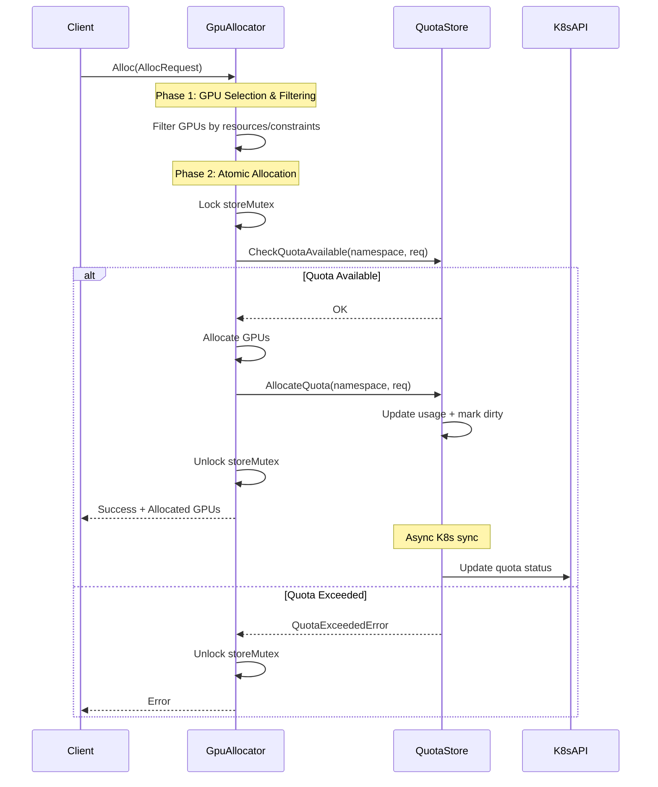
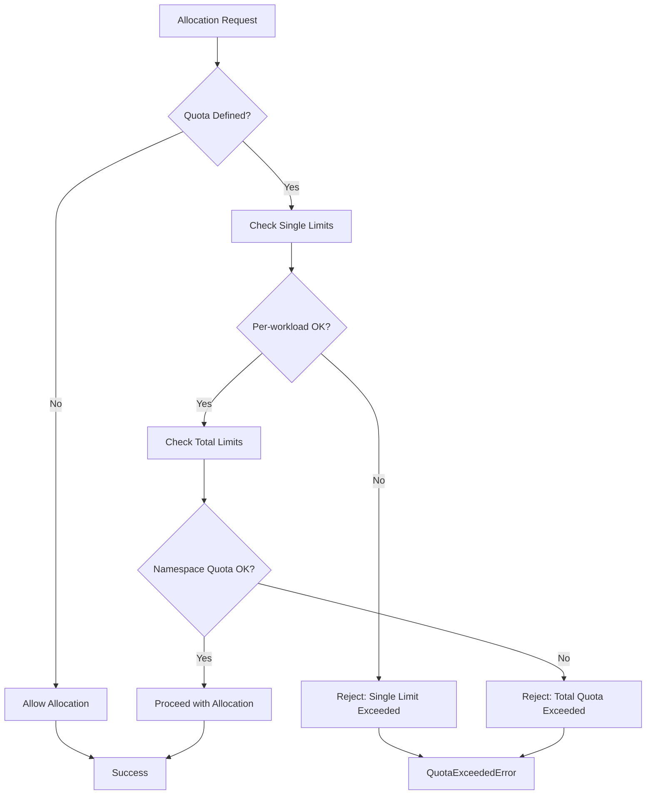
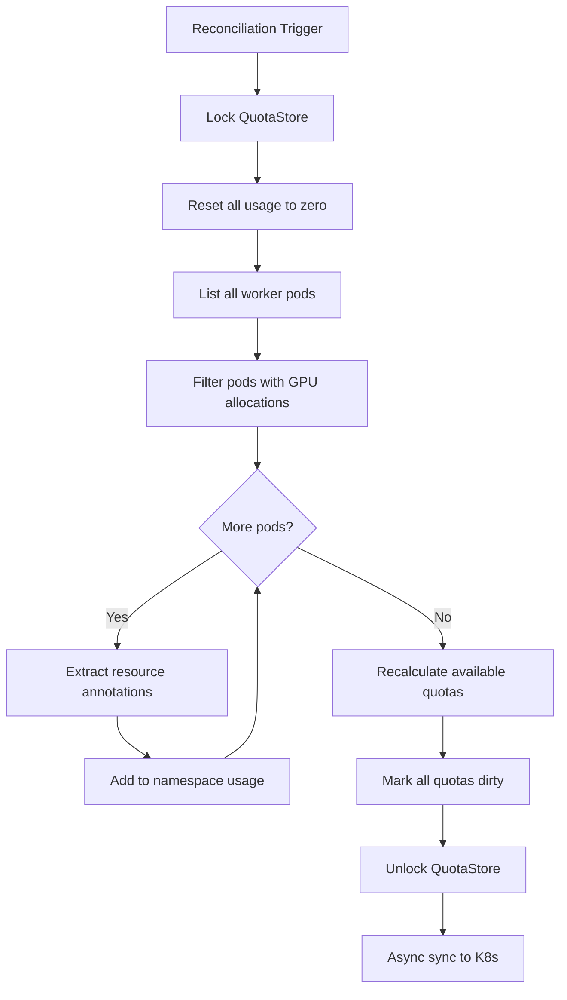

# Namespaced GPU Resource Quota System

## Overview

The GPU Resource Quota System provides namespace-scoped resource management for GPU workloads. It enforces both namespace-wide and per-workload resource limits while maintaining high performance through in-memory operations and atomic allocation guarantees.

### Design Principles
- **Performance**: Critical operations use in-memory data structures
- **Atomicity**: All quota operations are atomic to prevent over-allocation  
- **Kubernetes Native**: Standard CRD and controller patterns
- **Reconciliation**: State can be rebuilt from actual cluster resources

## Architecture

### Core Components
```
┌─────────────────────────────────────────────────────────┐
│                    Kubernetes API                       │
├─────────────────┬─────────────────┬─────────────────────┤
│ GPUResourceQuota│   Worker Pods   │   TensorFusion CRDs │
│      (CRD)      │                 │                     │
└─────────────────┴─────────────────┴─────────────────────┘
          │                   │               │
          │                   │               │
          ▼                   ▼               ▼
┌─────────────────┐ ┌─────────────────┐ ┌─────────────────┐
│ Quota Informer  │ │  GPU Allocator  │ │ Quota Controller│
│                 │ │                 │ │   (Monitoring)  │
└─────────────────┘ └─────────────────┘ └─────────────────┘
          │                   │               │
          │                   ▼               │
          │          ┌─────────────────┐      │
          └─────────▶│   Quota Store   │◀─────┘
                     │   (In-Memory)   │
                     └─────────────────┘
```

### Component Responsibilities

#### 1. QuotaStore (Core Engine)
- **Real-time Quota Enforcement**: Atomic check/allocate/deallocate operations
- **Authoritative State**: Single source of truth for quota usage
- **Pod-based Usage Tracking**: Calculate usage from actual running pods
- **Status Updates**: Exclusive responsibility for updating quota status in K8s
- **State Reconciliation**: Rebuild quota state from cluster resources

#### 2. GpuAllocator (Integration Point)
- Integrate quota checking into GPU allocation pipeline
- Ensure atomic GPU + quota allocation operations
- Handle allocation failures gracefully

#### 3. GPUResourceQuotaReconciler (Controller)
- Monitor expected vs actual resource usage
- Generate alerts when thresholds are exceeded
- Provide governance and planning insights

## Data Models

### 1. GPUResourceQuota CRD
```yaml
apiVersion: tensor-fusion.ai/v1
kind: GPUResourceQuota
metadata:
  name: team-quota
  namespace: team-a
spec:
  total:                          # Namespace-wide limits
    requests:
      tflops: "1000"             # Total compute requests
      vram: "100Gi"              # Total memory requests
    limits:
      tflops: "2000"             # Total compute limits
      vram: "200Gi"              # Total memory limits
    maxWorkers: 50               # Total worker limit
    alertThresholdPercent: 95    # Alert trigger (default: 95)
  single:                        # Per-workload constraints
    maxRequests:
      tflops: "100"              # Max compute per workload
      vram: "16Gi"               # Max memory per workload
    maxLimits:
      tflops: "200"              # Max limit per workload
      vram: "32Gi"               # Max limit per workload
    maxGPUCount: 8               # Max GPUs per workload
```

### 2. Core Data Types
```go
// Resource represents GPU compute and memory resources
type Resource struct {
    Tflops resource.Quantity `json:"tflops"`  // Compute capacity
    Vram   resource.Quantity `json:"vram"`    // Memory capacity
}

// GPUResourceUsage tracks current usage
type GPUResourceUsage struct {
    Requests Resource `json:"requests,omitempty"`
    Limits   Resource `json:"limits,omitempty"`
    Workers  *int32   `json:"workers,omitempty"`
}

// QuotaStoreEntry represents in-memory quota state
type QuotaStoreEntry struct {
    Quota        *GPUResourceQuota  // K8s resource definition
    CurrentUsage *GPUResourceUsage  // Real-time usage (authoritative)
}

// AllocRequest represents allocation request
type AllocRequest struct {
    PoolName              string
    WorkloadNameNamespace NameNamespace
    Request               Resource      // Resource requests
    Limit                 Resource      // Resource limits
    Count                 uint          // Number of GPUs
    GPUModel              string
    NodeAffinity          *v1.NodeAffinity
}
```

### 3. QuotaStore Structure
```go
type QuotaStore struct {
    client.Client
    QuotaStore     map[string]*QuotaStoreEntry  // namespace -> quota
    StoreMutex     sync.RWMutex                 // thread safety
    dirtyQuotas    map[string]struct{}          // sync optimization
    dirtyQuotaLock sync.Mutex
    Calculator     *Calculator                  // shared calculation logic
}
```

## Core Workflows

### 1. GPU Allocation with Quota Check


### 2. Quota Validation Logic


### 3. Quota Validation Implementation
```go
func (qs *QuotaStore) CheckQuotaAvailable(namespace string, req *AllocRequest) error {
    entry, exists := qs.QuotaStore[namespace]
    if !exists {
        return nil  // No quota defined, allow allocation
    }
    
    // 1. Check single (per-workload) limits
    if err := qs.checkSingleQuotas(entry, req); err != nil {
        return err
    }
    
    // 2. Check total namespace limits  
    return qs.checkTotalQuotas(entry, req)
}
```

### 4. State Reconciliation


## Key Features

### 1. Resource Constants
```go
const (
    // Single workload limits
    MaxTFlopsLimitResource   = "single.max.tflops.limit"
    MaxVRAMLimitResource     = "single.max.vram.limit"
    MaxTFlopsRequestResource = "single.max.tflops.request"
    MaxVRAMRequestResource   = "single.max.vram.request"
    MaxGPULimitResource      = "single.max.gpuCount.limit"

    // Total namespace limits
    TotalMaxTFlopsLimitResource   = "total.max.tflops.limit"
    TotalMaxVRAMLimitResource     = "total.max.vram.limit"
    TotalMaxTFlopsRequestResource = "total.max.tflops.request"
    TotalMaxVRAMRequestResource   = "total.max.vram.request"
    TotalMaxWorkersLimitResource  = "total.max.workers.limit"
)
```

### 2. Error Handling
```go
type QuotaExceededError struct {
    Namespace string
    Resource  string
    Requested resource.Quantity
    Limit     resource.Quantity
}

func (e *QuotaExceededError) Error() string {
    return fmt.Sprintf("quota exceeded in namespace %s for %s: requested %s, limit %s",
        e.Namespace, e.Resource, e.Requested.String(), e.Limit.String())
}
```

### 3. Performance Optimizations
- **In-Memory Operations**: Critical path uses local data structures
- **Single Mutex**: Both GPU and quota state protected by same lock
- **Dirty Flag Pattern**: Batch K8s API updates to reduce overhead
- **Concurrent Reads**: RWMutex allows concurrent status queries

### 4. Status and Monitoring
```go
type GPUResourceQuotaStatus struct {
    Used             GPUResourceUsage            `json:"used,omitempty"`
    AvailablePercent GPUResourceAvailablePercent `json:"availablePercent,omitempty"`
    Conditions       []metav1.Condition          `json:"conditions,omitempty"`
    LastUpdateTime   *metav1.Time                `json:"lastUpdateTime,omitempty"`
}
```

**Standard Conditions:**
- `Ready`: Quota is functioning normally
- `Exceeded`: Quota limits have been exceeded
- `AlertThresholdReached`: Usage exceeds alert threshold

## Integration Points

### 1. GPU Allocator Integration
- Quota checking integrated as allocation filter
- Two-phase commit: check availability then allocate atomically
- Single mutex protects both GPU and quota state

### 2. Kubernetes Events
- Informer watches for GPUResourceQuota CRD changes
- Handles create/update/delete events
- Maintains in-memory state synchronized with K8s

### 3. Reconciliation Engine
- Rebuilds quota usage from actual pod resources
- Handles state corruption recovery
- Ensures consistency between declared and actual state

This design provides efficient, atomic GPU resource management while maintaining simplicity and following Kubernetes patterns.