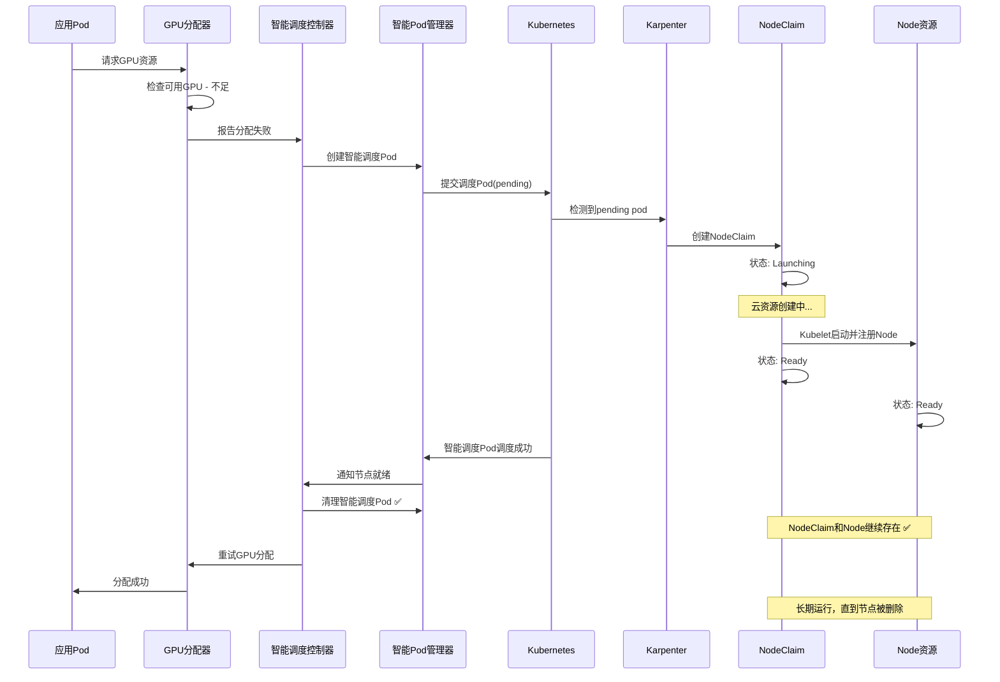

# Karpenter集成设计：基于智能Pod调度的GPU资源自动扩容

## 概述

本设计文档基于对Karpenter NodeClaim工作机制的深入研究，提出了一个全新的GPU资源自动扩容方案。该方案不直接操作NodeClaim（因为Karpenter不推荐这样做），而是通过智能Pod调度机制来触发Karpenter的自动扩容，实现更高效、更符合Karpenter设计理念的GPU资源管理。

## 问题分析

### 原始问题
当GPU分配因资源不足而失败时，Karpenter无法感知并自动扩容具有所需GPU类型的新节点。

### 关键发现
通过研究Karpenter的工作机制，我们发现：
1. **NodeClaim不应该被外部直接创建** - Karpenter官方明确说明NodeClaim由Karpenter自动管理
2. **Karpenter通过监控pending pods来触发扩容** - 这是Karpenter的核心工作原理
3. **正确的方法是创建合适的Pod来触发NodeClaim创建**

## 核心设计理念

### 智能Pod触发机制
```
GPU分配失败 → 创建智能调度Pod → Karpenter检测到pending pod 
→ 自动创建NodeClaim → 节点就绪 → 清理智能调度Pod → 重试原始分配
```

这个方案的优势：
- **符合Karpenter设计理念** - 通过Pod需求触发扩容
- **无需直接操作NodeClaim** - 让Karpenter自动管理
- **响应速度快** - Karpenter能在几秒内响应pending pods
- **资源开销小** - 智能调度Pod只是轻量级的信号

## 解决方案架构

### 1. 核心组件

#### 1.1 智能调度控制器 (Intelligent Scheduling Controller)
**位置**: `internal/controller/intelligent_scheduling_controller.go`

**职责**:
- 监控GPU分配失败
- 创建智能调度Pod来触发Karpenter
- 监控NodeClaim状态变化
- 管理智能调度Pod的生命周期
- 在节点就绪后清理Pod并重试分配

#### 1.2 智能调度Pod管理器 (Smart Pod Manager)
**位置**: `internal/karpenter/smart_pod_manager.go`

**职责**:
- 生成针对特定GPU类型的调度Pod规范
- 创建具有精确资源需求的调度Pod
- 监控Pod调度状态和节点绑定
- 在合适时机清理调度Pod

#### 1.3 NodeClaim状态监控器 (NodeClaim Monitor)
**位置**: `internal/karpenter/nodeclaim_monitor.go`

**职责**:
- 监控Karpenter创建的NodeClaim
- 跟踪NodeClaim从创建到Ready的全过程
- 在节点Ready时触发资源可用性检查
- 提供NodeClaim状态的实时反馈

### 2. 设计详情

#### 2.1 核心工作流程

**重要说明**：NodeClaim和Node是长期共存的资源，只有智能调度Pod是临时资源。NodeClaim不会在节点创建后被删除，它会与Node一起运行直到节点被删除时才会被Karpenter清理。



#### 2.2 智能调度Pod规范

智能调度Pod的关键特点：
- **精确的资源请求** - 反映真实的GPU需求
- **合适的调度约束** - 确保触发正确的NodePool
- **最小的运行开销** - 使用轻量级容器
- **明确的标识** - 便于监控和清理

```yaml
apiVersion: v1
kind: Pod
metadata:
  name: smart-gpu-scheduler-<gpu-model>-<hash>
  namespace: tensor-fusion-system
  labels:
    tensor-fusion.ai/component: smart-scheduler
    tensor-fusion.ai/gpu-model: <gpu-model>
    tensor-fusion.ai/pool: <pool-name>
    tensor-fusion.ai/trigger-type: gpu-scaling
  annotations:
    tensor-fusion.ai/created-by: intelligent-scheduling-controller
    tensor-fusion.ai/purpose: trigger-karpenter-scaling
    tensor-fusion.ai/original-request: <serialized-request>
    tensor-fusion.ai/cleanup-after: "node-ready"
spec:
  restartPolicy: Never
  schedulerName: default-scheduler
  # 关键：设置合适的调度约束
  nodeSelector:
    node.kubernetes.io/instance-type: <gpu-instance-type>
  tolerations:
  - key: nvidia.com/gpu
    operator: Exists
    effect: NoSchedule
  # 关键：设置精确的资源请求
  containers:
  - name: gpu-trigger
    image: registry.k8s.io/pause:3.9  # 最轻量级的容器
    resources:
      requests:
        nvidia.com/gpu: <gpu-count>
        memory: <vram-equivalent>
        cpu: 100m  # 最小CPU请求
      limits:
        nvidia.com/gpu: <gpu-count>
        memory: <vram-equivalent>
        cpu: 100m
  # 关键：防止长时间运行
  activeDeadlineSeconds: 600  # 10分钟后自动清理
```

#### 2.3 智能调度控制器实现

```go
type IntelligentSchedulingController struct {
    client.Client
    Scheme              *runtime.Scheme
    SmartPodManager     *SmartPodManager
    NodeClaimMonitor    *NodeClaimMonitor
    cleanupInterval     time.Duration
    maxRetryAttempts    int
}

// 核心协调逻辑
func (isc *IntelligentSchedulingController) Reconcile(ctx context.Context, req ctrl.Request) (ctrl.Result, error) {
    // 处理智能调度Pod状态变化
    // 监控NodeClaim创建和就绪状态
    // 触发资源可用性检查
    // 管理Pod清理和重试逻辑
}

// 触发GPU扩容的智能调度
func (isc *IntelligentSchedulingController) TriggerIntelligentScaling(ctx context.Context, failure AllocationFailure) error {
    // 1. 分析失败原因和资源需求
    // 2. 生成智能调度Pod规范
    // 3. 创建调度Pod
    // 4. 启动NodeClaim监控
    // 5. 设置清理和重试逻辑
}

// 处理节点就绪事件
func (isc *IntelligentSchedulingController) HandleNodeReady(ctx context.Context, nodeClaimName string) error {
    // 1. 清理对应的智能调度Pod
    // 2. 触发GPU资源可用性检查
    // 3. 重试原始分配请求
    // 4. 更新监控指标
}
```

#### 2.4 智能Pod管理器实现

```go
type SmartPodManager struct {
    client.Client
    activePods      map[string]*SmartPodInfo
    mutex           sync.RWMutex
    podTemplate     *corev1.Pod
}

type SmartPodInfo struct {
    Pod                 *corev1.Pod
    CreationTime        time.Time
    GPUModel            string
    PoolName            string
    OriginalRequest     AllocRequest
    NodeClaimName       string
    Status              SmartPodStatus
    RetryCount          int
}

type SmartPodStatus string

const (
    SmartPodStatusPending    SmartPodStatus = "Pending"
    SmartPodStatusScheduled  SmartPodStatus = "Scheduled"
    SmartPodStatusNodeReady  SmartPodStatus = "NodeReady"
    SmartPodStatusCompleted  SmartPodStatus = "Completed"
    SmartPodStatusFailed     SmartPodStatus = "Failed"
)

// 创建智能调度Pod
func (spm *SmartPodManager) CreateSmartPod(ctx context.Context, failure AllocationFailure) (*SmartPodInfo, error) {
    // 1. 生成Pod规范
    // 2. 设置精确的资源请求
    // 3. 配置调度约束
    // 4. 创建Pod并跟踪状态
    // 5. 返回Pod信息用于监控
}

// 监控Pod调度状态
func (spm *SmartPodManager) MonitorPodScheduling(ctx context.Context, podInfo *SmartPodInfo) error {
    // 1. 监控Pod调度到节点
    // 2. 检测NodeClaim创建
    // 3. 跟踪节点初始化过程
    // 4. 更新Pod状态
}

// 清理完成的智能调度Pod
func (spm *SmartPodManager) CleanupCompletedPods(ctx context.Context) error {
    // 1. 遍历活跃的智能调度Pod
    // 2. 检查对应节点是否就绪且资源可用
    // 3. 删除已完成使命的智能调度Pod（注意：不删除NodeClaim和Node）
    // 4. 更新统计信息
}
```

#### 2.5 NodeClaim监控器实现

```go
type NodeClaimMonitor struct {
    client.Client
    activeNodeClaims map[string]*NodeClaimInfo
    mutex            sync.RWMutex
    eventChannel     chan NodeClaimEvent
}

type NodeClaimInfo struct {
    NodeClaim       *karpenterv1.NodeClaim
    CreationTime    time.Time
    Status          NodeClaimPhase
    AssociatedPod   string
    NodeName        string
}

type NodeClaimEvent struct {
    Type         NodeClaimEventType
    NodeClaim    string
    Node         string
    Timestamp    time.Time
}

type NodeClaimEventType string

const (
    NodeClaimCreated     NodeClaimEventType = "Created"
    NodeClaimLaunching   NodeClaimEventType = "Launching"
    NodeClaimRegistering NodeClaimEventType = "Registering"
    NodeClaimReady       NodeClaimEventType = "Ready"
    NodeClaimFailed      NodeClaimEventType = "Failed"
)

// 监控NodeClaim生命周期
func (ncm *NodeClaimMonitor) MonitorNodeClaim(ctx context.Context, nodeClaimName string) error {
    // 1. 订阅NodeClaim状态变化
    // 2. 跟踪从创建到Ready的全过程
    // 3. 发送状态变化事件
    // 4. 处理失败和超时情况
}

// 检测新创建的NodeClaim
func (ncm *NodeClaimMonitor) DetectNewNodeClaims(ctx context.Context) error {
    // 1. 监听NodeClaim创建事件
    // 2. 关联到对应的智能调度Pod
    // 3. 开始状态跟踪
    // 4. 更新监控指标
}
```

### 3. 集成点

#### 3.1 GPU分配器集成

```go
func (s *GpuAllocator) Alloc(ctx context.Context, req AllocRequest) ([]*tfv1.GPU, error) {
    // ... 现有分配逻辑 ...
    
    if len(filteredGPUs) == 0 {
        failure := AllocationFailure{
            Reason:       AllocationFailureInsufficientResources,
            GPUModel:     req.GPUModel,
            PoolName:     req.PoolName,
            RequestedGPU: req.Count,
            TFlops:       req.Request.Tflops,
            VRAMRequest:  req.Request.Vram,
            NodeAffinity: req.NodeAffinity,
        }
        
        // 触发智能调度扩容
        if err := s.triggerIntelligentScaling(ctx, failure); err != nil {
            log.FromContext(ctx).Error(err, "智能调度扩容触发失败")
        }
        
        return nil, fmt.Errorf("池%s中GPU资源不足，已触发自动扩容", req.PoolName)
    }
    
    // ... 其余现有逻辑 ...
}

// 触发智能调度扩容
func (s *GpuAllocator) triggerIntelligentScaling(ctx context.Context, failure AllocationFailure) error {
    // 检查是否已经有相同类型的扩容请求在进行
    if s.hasActivScalingRequest(failure.GPUModel, failure.PoolName) {
        return nil // 避免重复触发
    }
    
    // 创建智能调度请求
    return s.intelligentScheduler.TriggerIntelligentScaling(ctx, failure)
}
```

#### 3.2 NodePool配置集成

```yaml
apiVersion: karpenter.sh/v1
kind: NodePool
metadata:
  name: gpu-a100-pool
spec:
  template:
    metadata:
      labels:
        tensor-fusion.ai/gpu-type: "a100"
        tensor-fusion.ai/managed: "true"
    spec:
      requirements:
      - key: karpenter.k8s.aws/instance-gpu-name
        operator: In
        values: ["a100"]
      - key: karpenter.k8s.aws/instance-category
        operator: In
        values: ["p"]
      - key: node.kubernetes.io/instance-type
        operator: In
        values: ["p4d.24xlarge", "p5.48xlarge"]
      nodeClassRef:
        group: karpenter.k8s.aws
        kind: EC2NodeClass
        name: gpu-a100-nodeclass
      taints:
      - key: nvidia.com/gpu
        value: "true"
        effect: NoSchedule
  disruption:
    consolidationPolicy: WhenEmpty
    consolidateAfter: 30s
```

### 4. 优势分析

#### 4.1 技术优势
- **原生兼容** - 完全符合Karpenter的设计理念
- **响应迅速** - 利用Karpenter的秒级响应能力
- **资源高效** - 智能调度Pod资源开销极小
- **状态透明** - 可以清楚跟踪整个扩容过程

#### 4.2 运维优势
- **监控友好** - 所有状态变化都有明确的事件和指标
- **故障处理** - 内置超时和重试机制
- **资源清理** - 自动清理临时资源，避免泄漏
- **扩展性好** - 可以轻松支持多种GPU类型和规格

### 5. 实施计划

#### 第一阶段：基础设施（2周）
1. 实现基础的智能调度控制器框架
2. 创建智能Pod管理器
3. 集成到现有GPU分配器

#### 第二阶段：监控系统（2周）
1. 实现NodeClaim监控器
2. 建立状态事件系统
3. 添加监控指标和日志

#### 第三阶段：优化清理（2周）
1. 实现智能清理逻辑
2. 添加重试和故障处理
3. 性能优化和资源管理

#### 第四阶段：测试验证（2周）
1. 单元测试和集成测试
2. 真实环境验证
3. 文档和示例

### 6. 监控和运维

#### 6.1 关键指标
- `tensor_fusion_smart_pods_created_total`: 创建的智能调度Pod总数
- `tensor_fusion_smart_pods_active`: 当前活跃的智能调度Pod数量
- `tensor_fusion_nodeclaim_provision_duration`: NodeClaim提供时间
- `tensor_fusion_scaling_success_rate`: 扩容成功率

#### 6.2 告警规则
- 智能调度Pod长时间pending
- NodeClaim创建失败率过高
- 扩容响应时间过长
- 资源清理失败

## 总结

这个新设计完全基于Karpenter的原生工作机制，通过智能Pod调度来触发自动扩容，避免了直接操作NodeClaim的复杂性。该方案不仅技术上更加可靠，而且在运维上更加友好，是一个真正符合云原生理念的GPU资源自动扩容解决方案。